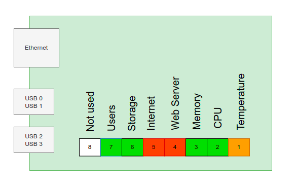

# Raspberry-tools

This class is used to monitoring Raspberry Pi and display information on Pimoroni Neo-Pixel shield


## Layout


## Installation

First, update of system
```
sudo apt-get update 
sudo apt-get -y upgrade
```

Then install :

```
sudo apt-get install python3-pip
python3 -m pip install psutil
python3 -m pip install netifaces
```

Write this line and accept all step :
```
curl https://get.pimoroni.com/blinkt | bash
```


## Edit the systemctl/systemd 

This file must be called at startup. 

By following the next steps, you will be eager to start script on startup


*Let's start*

First of all, in the `/etc/systemd/system/` directory, let's create a file called **rpi_monitoring.service** : 

```
sudo nano /etc/systemd/system/rpi_monitoring.service
```
The service is called **rpi_monitoring**

In the new file, let's write :
```
[Unit]
Description=RPI monitoring script
After=multi-user.target
[Service]
Type=simple
Restart=always
ExecStart=/usr/bin/python3 /home/<username>/<folder>/System.py
[Install]
WantedBy=multi-user.target
```

The line containing `/home/<username>/<folder>System.py` contains the absolute path of the **System.py** script.

For example, `ExecStart=/usr/bin/python3 /home/pi/documents/System.py`

Then, we restart deamon : 

```
sudo systemctl daemon-reload
```

## Enable the service

If the service is enable, this last will start at starup at each reboot
```
sudo systemctl enable rpi_monitoring.service
```
And to disable service : `sudo systemctl disable rpi_monitoring.service`

## Start the service

```
sudo systemctl start rpi_monitoring.service
```
and to stop : `sudo systemctl stop rpi_monitoring.service`

## Check the status 

```
sudo systemctl status rpi_monitoring
```

## Array of LED

There is an array of 8 leds on the shield, each LED is representing a status of service or application

## Led status

LED 1 : Temperature (T)

| Value    |   LED color   |
|----------|-------------|
| T <= 55°C |  Green|
| 55°C < T <= 70°C | Orange |
| T > 70°C | Red |


LED 2 : CPU Usage (%)  

| Value    |   LED color   |
|----------|:-------------:|
| cpu < 10% |  Green |
| 10% < cpu <= 60°C |    Orange   |
| cpu > 60% | Red |

LED 3 : Memory Usage (%)  

| Value    |   LED color   |
|----------|:-------------:|
| mem < 20% |  Green |
| 20% < mem <= 70°C |    Orange   |
| cpu > 70% | Red |

LED 4 : Web server  

| Value    |   LED color   |
|----------|:-------------:|
| Enabled |  Green |
| Disabled |    Red   |

LED 5 : Internet connection

| Value    |   LED color   |
|----------|:-------------:|
| Wifi disable and ethernet enabled   |    Green   |
 Wifi enabled and Ethernet enabled |  Orange |
| Wifi enabled and Ethernet disabled |  Orange |
| Wifi disabled and ethernet disabled   |    Red   |


LED 6 : Storage Usage (%) of '/'

| Value    |   LED color   |
|----------|:-------------:|
| storage < 40% |  Green |
| 40% < storage <= 90°C |    Orange   |
| storage > 90% | Red |

LED 7 : Number of users connected to the Raspberry Pi

| Value    |   LED color   |
|----------|:-------------:|
| user = 1|  Green Blinking one time per second |
| users > 1 | Orange blinking x users connected per second   |


