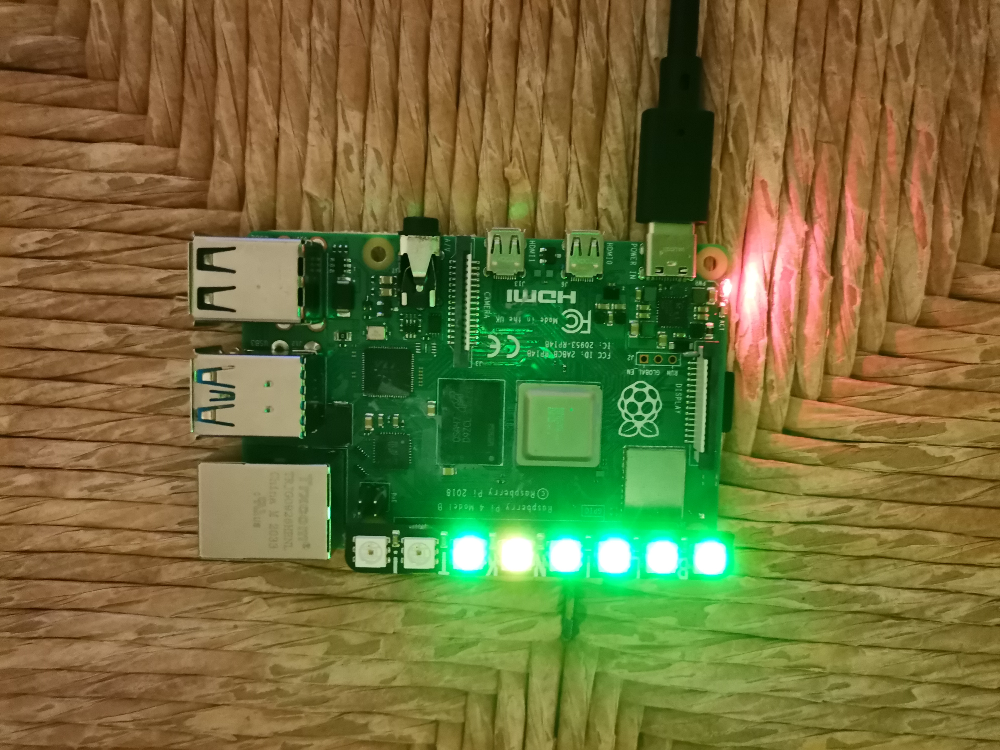

# Raspberry-tools

This class is used to monitoring Raspberry Pi and display information on Pimoroni Neo-Pixel shield




## Installation

First, update of system
```
sudo apt-get update 
sudo apt-get -y upgrade
```

Then install :

```
sudo apt-get install python3-pip
python3 -m pip install psutil
python3 -m pip install netifaces
```

Write this line and accept all step :
```
curl https://get.pimoroni.com/blinkt | bash
```


## Edit the systemctl/systemd 

This file must be called at startup. 

By following the next steps, you will be eager to start script on startup


*Let's start*

First of all, in the `/etc/systemd/system/` directory, let's create a file called **rpi_monitoring.service** : 

```
sudo nano /etc/systemd/system/rpi_monitoring.service
```
The service is called **rpi_monitoring**

In the new file, let's write :
```
[Unit]
Description=RPI monitoring script
After=multi-user.target
[Service]
Type=simple
Restart=always
ExecStart=/usr/bin/python3 /home/<username>/<folder>/System.py
[Install]
WantedBy=multi-user.target
```

The line containing `/home/<username>/<folder>System.py` contains the absolute path of the **System.py** script.

For example, `ExecStart=/usr/bin/python3 /home/pi/documents/System.py`

Then, we restart deamon : 

```
sudo systemctl daemon-reload
```

## Enable the service

If the service is enable, this last will start at starup at each reboot
```
sudo systemctl enable rpi_monitoring.service
```
And to disable service : `sudo systemctl disable rpi_monitoring.service`

## Start the service

```
sudo systemctl start rpi_monitoring.service
```
and to stop : `sudo systemctl stop rpi_monitoring.service`

## Check the status 

```
sudo systemctl status rpi_monitoring
```


